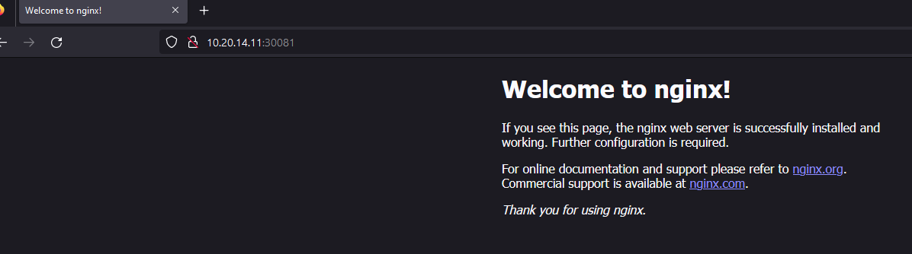

## How to running

```bash
kubectl create ns nginx-limit-pod

kubectl create -f nginx-deployment-limit.yaml
```

## Verify

```
kubectl get all -o wide -n nginx-limit-pod

root@aj-rke1:~/kube# kubectl get all -o wide -n nginx-limit-pod
NAME                                    READY   STATUS    RESTARTS   AGE    IP           NODE      NOMINATED NODE   READINESS GATES
pod/nginx-deployment-6d88c5685b-4njdv   1/1     Running   0          109s   10.42.2.16   aj-rke2   <none>           <none>
pod/nginx-deployment-6d88c5685b-8hblz   1/1     Running   0          109s   10.42.0.24   aj-rke1   <none>           <none>
pod/nginx-deployment-6d88c5685b-9mjxt   1/1     Running   0          109s   10.42.2.18   aj-rke2   <none>           <none>
pod/nginx-deployment-6d88c5685b-cz88g   1/1     Running   0          109s   10.42.0.25   aj-rke1   <none>           <none>
pod/nginx-deployment-6d88c5685b-fsj5b   1/1     Running   0          109s   10.42.0.23   aj-rke1   <none>           <none>
pod/nginx-deployment-6d88c5685b-kbnjj   1/1     Running   0          109s   10.42.2.17   aj-rke2   <none>           <none>

NAME                          TYPE       CLUSTER-IP      EXTERNAL-IP   PORT(S)        AGE    SELECTOR
service/nginx-service-limit   NodePort   10.43.204.105   <none>        80:30081/TCP   109s   app=nginx-limit

NAME                               READY   UP-TO-DATE   AVAILABLE   AGE    CONTAINERS        IMAGES   SELECTOR
deployment.apps/nginx-deployment   6/6     6            6           109s   nginx-container   nginx    app=nginx-limit

NAME                                          DESIRED   CURRENT   READY   AGE    CONTAINERS        IMAGES   SELECTOR
replicaset.apps/nginx-deployment-6d88c5685b   6         6         6       109s   nginx-container   nginx    app=nginx-limit,pod-template-hash=6d88c5685b
```

#### Describe 
```
root@aj-rke1:~/kube# kubectl describe deployment nginx-deployment -n nginx-limit-pod
Name:                   nginx-deployment
Namespace:              nginx-limit-pod
CreationTimestamp:      Mon, 03 Jul 2023 22:44:47 +0000
Labels:                 <none>
Annotations:            deployment.kubernetes.io/revision: 1
                        field.cattle.io/publicEndpoints: [{"port":30081,"protocol":"TCP","serviceName":"nginx-limit-pod:nginx-service-limit","allNodes":true}]
Selector:               app=nginx-limit
Replicas:               6 desired | 6 updated | 6 total | 6 available | 0 unavailable
StrategyType:           RollingUpdate
MinReadySeconds:        0
RollingUpdateStrategy:  25% max unavailable, 25% max surge
Pod Template:
  Labels:  app=nginx-limit
  Containers:
   nginx-container:
    Image:      nginx
    Port:       <none>
    Host Port:  <none>
    Limits:
      memory:  128Mi
    Requests:
      memory:     128Mi
    Environment:  <none>
    Mounts:       <none>
  Volumes:        <none>
Conditions:
  Type           Status  Reason
  ----           ------  ------
  Available      True    MinimumReplicasAvailable
  Progressing    True    NewReplicaSetAvailable
OldReplicaSets:  <none>
NewReplicaSet:   nginx-deployment-6d88c5685b (6/6 replicas created)
Events:
  Type    Reason             Age    From                   Message
  ----    ------             ----   ----                   -------
  Normal  ScalingReplicaSet  4m58s  deployment-controller  Scaled up replica set nginx-deployment-6d88c5685b to 6
```


